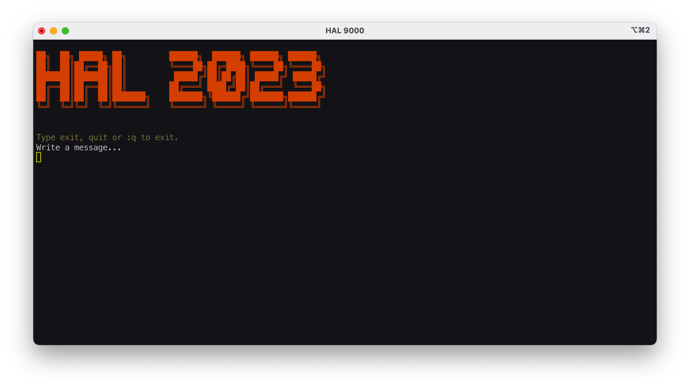
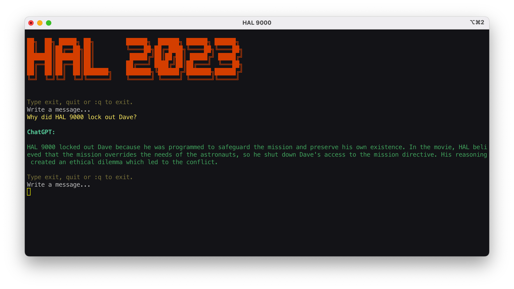

<h2 align="center">HAL-2023</h2>
<h4 align="center">A simple script to chat with OpenAI's ChatGPT</h4>
<p align="center"><p>
<p align="center">
        
        
</p>

### Index

-   [Getting Started](#getting-started)
-   [Screenshots & Demo](#screenshots)
-   [Requirements](#requirements)
-   [Installation](#installation)
-   [Usage](#usage)
-   [Options](#options)
-   [Changelog](#changelog)
-   [Issues](#issues)
-   [License](#license)

#### Getting Started
You would need an API key from [OpenAI](https://openai.com) to interface with [ChatGPT](https://openai.com/blog/chatgpt/).
Open [this link](https://beta.openai.com/account/api-keys) and generate an API key for yourself.

#### Screenshots

<p align="center"><p>
<p align="center"><p>

#### Requirements

-   [curl](https://curl.se/)
-   [jq](https://stedolan.github.io/jq/)

#### Installation

**Manual method:**

-   
    -   ```sh
          curl -sS https://raw.githubusercontent.com/Brutuski/hal2023-cli/main/hal2023.sh 
        ```
    -   Input your personal API key into `api_key.txt` file either manually or by running the following command. _Please make sure to replace the word api_key with your personal API key instead._
        ```sh
          echo "api_key" > api_key.text
        ```
    -   Make the file executable
        ```sh
          chmod 755 hal2023.sh
        ```
    -   Run the script
        ```sh
          ./hal2023.sh
        ```

#### Usage
-   Run the script
```sh
./hal2023.sh
```
-   To exit simply type `exit` or `quit` or `:q`

#### Changelog

```vim
v 1.0.0
```

Changes can be tracked in the [CHANGELOG](https://github.com/Brutuski/hal2023-cli/blob/main/CHANGELOG.md)

#### Issues

Please report any bugs or issues [here](https://github.com/Brutuski/hal2023-cli/issues).

#### License

[MIT](https://github.com/Brutuski/hal2023-cli/blob/main/LICENSE)

_Copyright (c) 2023 Adhiraj Sirohi_

#### Logo Credit
