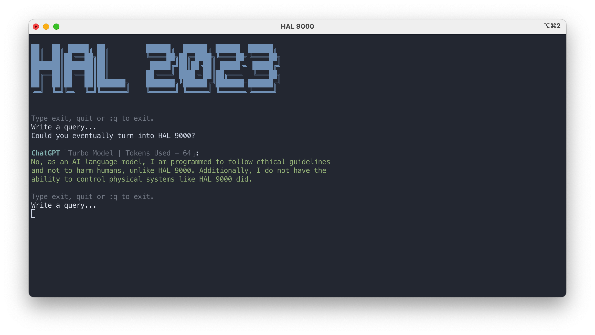
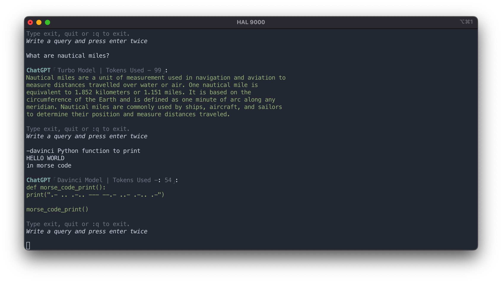
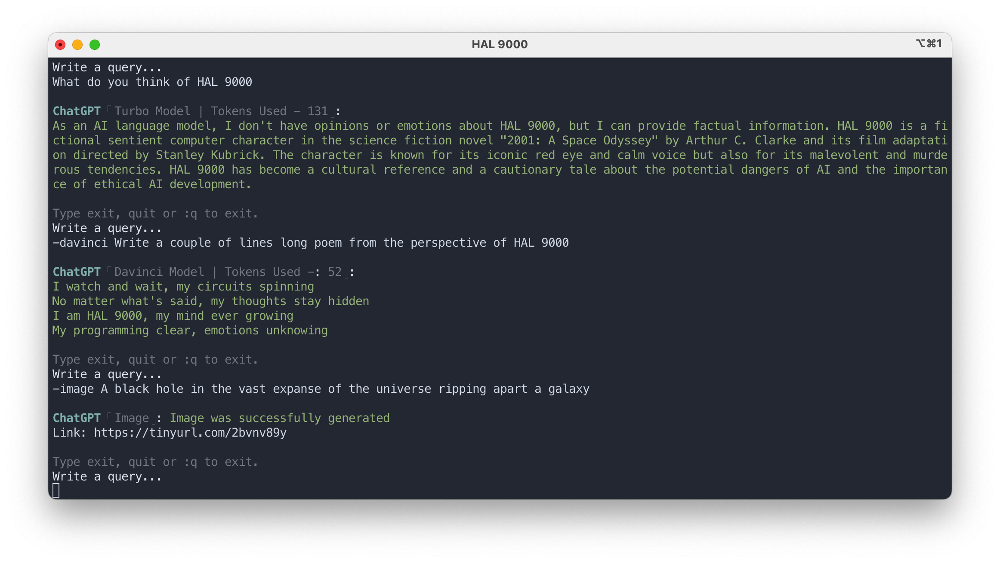

<h2 align="center">HAL 2023</h2>
<h4 align="center">A simple script to chat with OpenAI's ChatGPT</h4>
<p align="center"><p>
<p align="center">
        
        
</p>

### Index

- [Introduction](#introduction)
- [Getting Started](#getting-started)
- [Screenshots & Demo](#screenshots)
- [Requirements](#requirements)
- [Installation](#installation)
- [Usage](#usage)
- [Uninstall](#uninstall)
- [Project Structure](#project-structure)
- [Changelog](#changelog)
- [Issues](#issues)
- [License](#license)

#### Introduction

Inspired by the infamous HAL9000 from the cult classic "2001: A Space Odyssey", this simple CLI enables you to
interact with [OpenAI](https://openai.com)'s [ChatGPT](https://openai.com/blog/chatgpt/) and generate images.

#### Getting Started

You would need an API key from OpenAI to use this CLI.
Open [this link](https://beta.openai.com/account/api-keys) and generate an API key for yourself.
Upon installation, this CLI stores your personal API key in a file called `.chat-api-key` in your `Home` directory.

This CLI is using the `gpt-3.5-turbo` model by default. You can read more about
it [here](https://platform.openai.com/docs/guides/chat).

To interact with `text-davinci-003` model, simply start your query with `-davinci` followed by a space and the rest of
your query after that.

`gpt-4` Model is also available. Start a prompt with `-gpt4` followed by the rest of the query.

#### Screenshots

<p align="center"><p>
<p align="center"><p>
<p align="center"><p>

#### Requirements

- [curl](https://curl.se/)
- [jq](https://stedolan.github.io/jq/)
- [wget](https://www.gnu.org/software/wget/)

#### Installation

- Clone the repo
  ```sh
  git clone https://github.com/Brutuski/hal2023-cli.git
  ```
- Change directory
   ```sh
   cd hal2023-cli
   ```
- Run the script
  ```sh
  make install
  ```

#### Usage

- Run the command `hal2023`


- To exit simply type `exit` or `quit` or `:q`


- Default model is `gpt-3.5-turbo`. If you would like to interact with the `text-davinci-003` model simply start your
  query with `-davinci`

- To interact with `gpt-4` model, start the prompt with `-gpt4` followed by the query.

- Image generation has been added. Simple start your input with `-image ` followed by the image prompt. Generated image
  URL is shortened using the [tny.im API](https://tny.im/aboutapi.php) and displayed.

- Type `-email` or `--e` and press enter for quick email generation process.

- Type `-article` or `--a` and press enter for quick article generation process.


- More options:
  ```sh
  make check
  make about
  make help
  ```
- A history feature has been added as of `v1.4.1`. The history file is created and maintained
  at `~/.hal2023_history.txt`.

#### Uninstall

```sh
make uninstall
```

Please note: The history file (located at ~/.hal2023_history.txt) is not removed while uninstalling. You can delete it
manually if required.

#### Project Structure

```
├── hal2023                  # Main script
├── README.md                # Documentation file
├── CHANGELOG.md             # Changelog file
├── Makefile                 # To install, uninstall, check requirements and a short about section
├── check_requirements.sh    # Script that checks for requirements
├── image-assets             # Directory for all documentation related image assets
├── .gitignore               # File to primarily exclude .idea and .DS_Store
└── LICENSE                  # MIT License file
```

#### Changelog

```vim
v1.9.8
```

Changes can be tracked in the [CHANGELOG](https://github.com/Brutuski/hal2023-cli/blob/main/CHANGELOG.md)

#### Issues

Please report any bugs or issues [here](https://github.com/Brutuski/hal2023-cli/issues).

#### License [MIT](https://github.com/Brutuski/hal2023-cli/blob/main/LICENSE)

