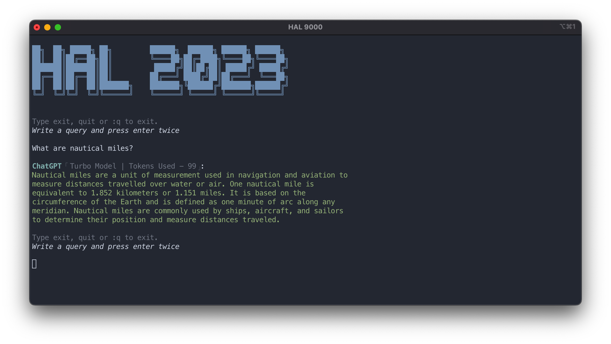
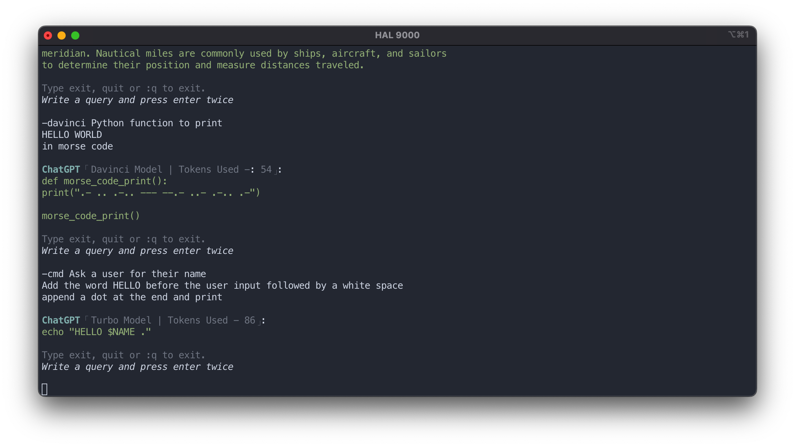

<p align="center"><p>
<h4 align="center">A simple script to chat with OpenAI's ChatGPT</h4>
<p align="center">
        
        <a href="https://github.com/Brutuski/hal2023-cli/blob/main/LICENSE"> </a>
        
</p>

### Index

- [Introduction](#introduction)
- [Getting Started](#getting-started)
- [Screenshots & Demo](#screenshots)
- [Requirements](#requirements)
- [Installation](#installation)
- [Usage](#usage)
- [Uninstall](#uninstall)
- [Project Structure](#project-structure)
- [Documentation](#documentation)
- [OpenAI's Data Policy](#openais-data-policy)
- [Credit](#credit)

#### Introduction

Inspired by the infamous HAL9000 from the cult classic "2001: A Space Odyssey", this simple CLI enables you to
interact with [OpenAI](https://openai.com)'s [ChatGPT](https://openai.com/blog/chatgpt/) and generate images.

#### Getting Started

You would need an API key from OpenAI to use this CLI.
Open [this link](https://beta.openai.com/account/api-keys) and generate an API key for yourself.
Upon installation, this CLI stores your personal API key in a file called `.chat-api-key` in your `Home` directory.

This CLI is using the `gpt-3.5-turbo` model by default. You can read more about
it [here](https://platform.openai.com/docs/guides/chat).

To interact with `text-davinci-003` model, simply start your query with `-davinci` followed by a space and the rest of
your query after that.

`gpt-4` Model is also available. Start a prompt with `-gpt4` followed by the rest of the query.

#### Screenshots

<p align="center"><p>
<p align="center"><p>
<p align="center"><p>
<p align="center"><p>

#### Requirements

- [curl](https://curl.se/)
- [jq](https://stedolan.github.io/jq/)
- [wget](https://www.gnu.org/software/wget/)

##### Optional

- [glow](https://github.com/charmbracelet/glow) helps with better output formatting.

#### Installation

```sh
curl -sS https://github.com/Brutuski/hal2023-cli/blob/main/build.sh | sudo -E bash
```

##### Manual Installation

- Download the latest release from [here](https://github.com/Brutuski/hal2023-cli/releases).
- Unzip it and copy `hal2023` to `/usr/local/bin`.
- You can copy it into any directory of your choice, but remember to add the path to your `$PATH`.
- Store your OpenAI API key in your home directory as such `~/.chat-gpt-api`. Paste only your API key in said file with
  no spaces or newlines.

#### Usage

- Run the command `hal2023`


- To exit simply type `exit` or `quit` or `:q`

- Multiline prompts are supported as. Press `enter` once
  to continue your prompt in a newline. Press `enter` twice to send the prompt.

- Default model is `gpt-3.5-turbo`. If you would like to interact with the `text-davinci-003` model simply start your
  prompt with `-davinci`

- To interact with `gpt-4` model, start the prompt with `-gpt4` followed by the query.

- Image generation has been added. Simple start your input with `-image ` followed by the image prompt. Generated image
  URL is shortened using the [tny.im API](https://tny.im/aboutapi.php) and displayed.

- Type `-email` or `--e` and press enter for quick email generation process.

- Type `-article` or `--a` and press enter for quick article generation process.

- Type `-cmd` followed by the query to generate single line shell commands ready to be executed in he terminal.


- More options:
  ```sh
  make check
  make about
  make help
  ```
- A history feature has been added as of `v1.4.1`. The history file is created and maintained
  at `~/.hal2023_history.txt`.

#### Uninstall

```sh
make uninstall
```

Please note: The history file (located at ~/.hal2023_history.txt) is not removed while uninstalling. You can delete it
manually if required.

#### Project Structure

```
├── hal2023                     # Main script
├── README.md                   # Documentation file
├── CONTRIBUTING.md             # Contributing document
├── CODE_OF_CONDUCT.md          # Code of Conduct document
├── build.sh                    # To install, check requirements and take API key input
├── image-assets                # Directory for all documentation related image assets
├── .gitignore                  # File to primarily exclude .idea and .DS_Store
├── .github                  
  ├── CHANGELOG.md              # Changelog
  ├── ISSUES_TEMPLATE.md        # Issues reporting template
  └── PULL_REQUEST_TEMPLATE.md  # Pull request submission template
└── LICENSE                     # MIT License file
```

#### Documentation

[Issues Template](.github/ISSUES_TEMPLATE.md). Please report any issues or feature
requests [here](https://github.com/Brutuski/hal2023-cli/issues).

Changes can be tracked in the [Changelog](.github/CHANGELOG.md)

To contribute, please check out [Contributing](CONTRIBUTING.md)
and [Pull Request Template](.github/PULL_REQUEST_TEMPLATE.md)

[Code of Conduct](CODE_OF_CONDUCT.md)

### OpenAI's Data Policy

Please refer to [OpenAI's data usage policy](https://openai.com/policies/api-data-usage-policies) to stay informed about
how your queries and prompts are being handled by them.

### Credit
The installation script was inspired by [bash-script-template](https://github.com/ralish/bash-script-template).
It replaced the previously used method of `Makefile` and a separate `check_requirements.sh` script.
